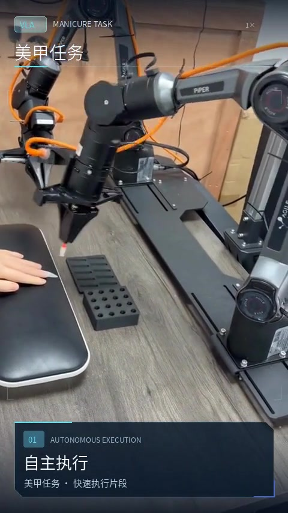
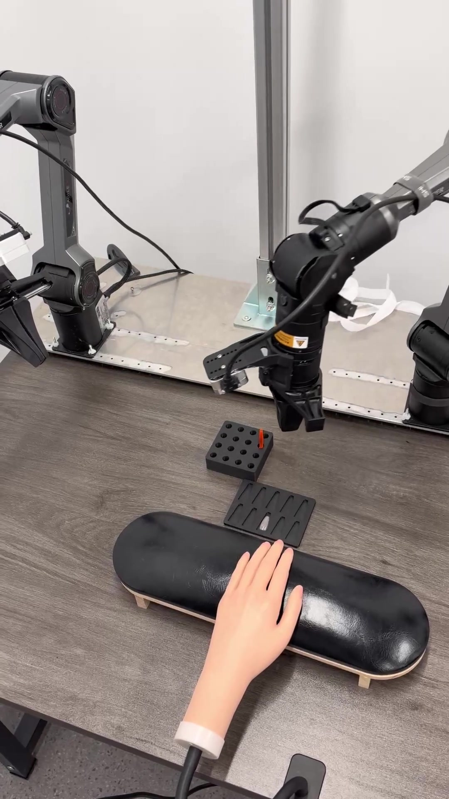
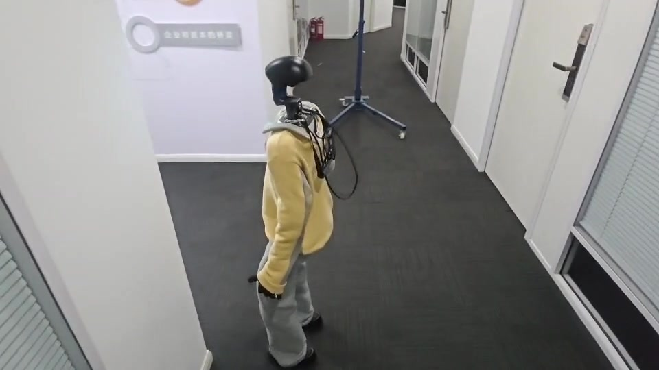
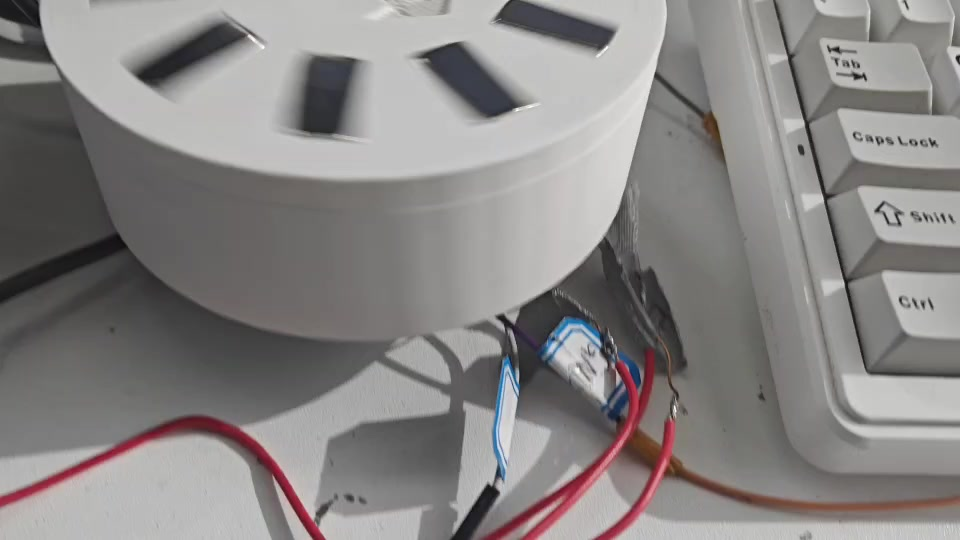
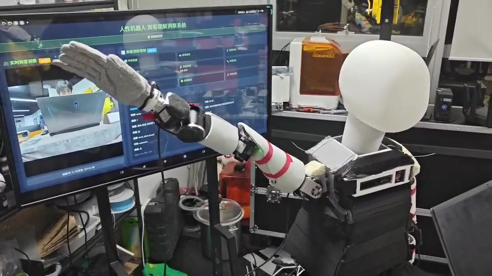

# 机器人项目 Demo 展示

<!-- GitHub 原生视频播放器改造 -->

> 本仓库用于集中展示机器人学习、避障控制、运动控制和可视化操作平台的项目成果。

## 视启未来

<table>
  <tr>
    <td align="center" width="50%">
      <h3>美甲效果展示1</h3>
      
      
▶ 点击播放视频

    </td>
    <td align="center" width="50%">
      <h3>美甲效果展示2</h3>
      
      
▶ 点击播放视频

    </td>
  </tr>
</table>

### RLT 操作网页

  

  

## 万仞

### G1避障展示

  

▶ 点击播放视频

### G1 可视化操作网页

  

<table>
  <tr>
    <td align="center" width="50%">
      <h3>电机demo展示</h3>
      
      
▶ 点击播放视频

    </td>
    <td align="center" width="50%">
      <h3>机械臂demo展示</h3>
      
      
▶ 点击播放视频

    </td>
  </tr>
</table>
