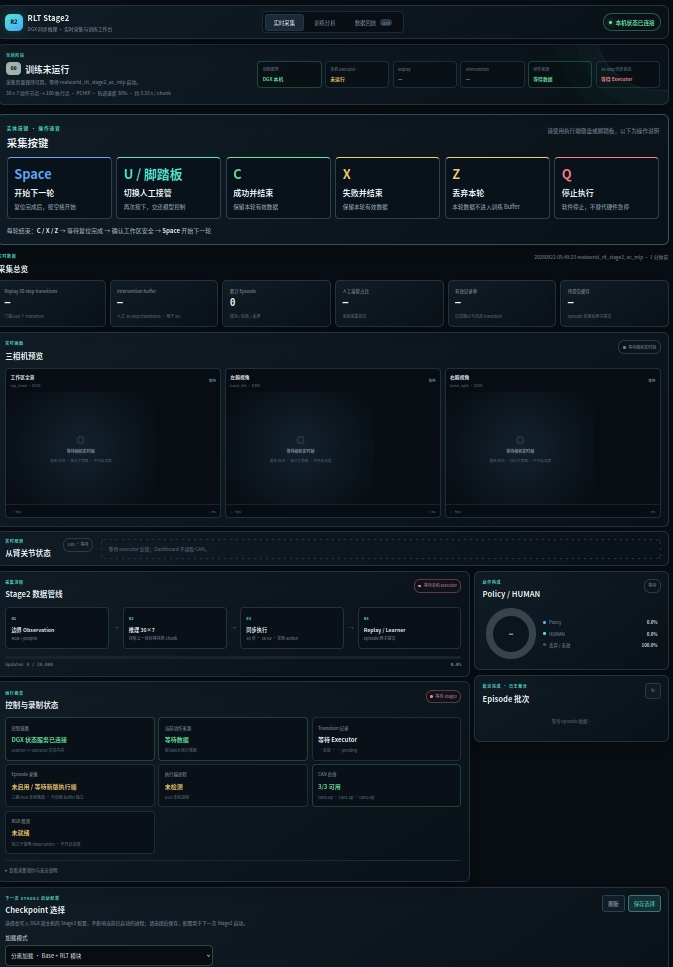
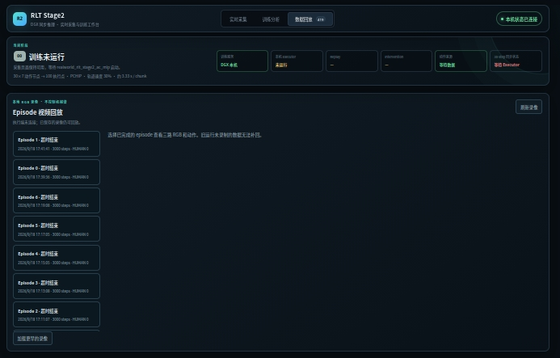
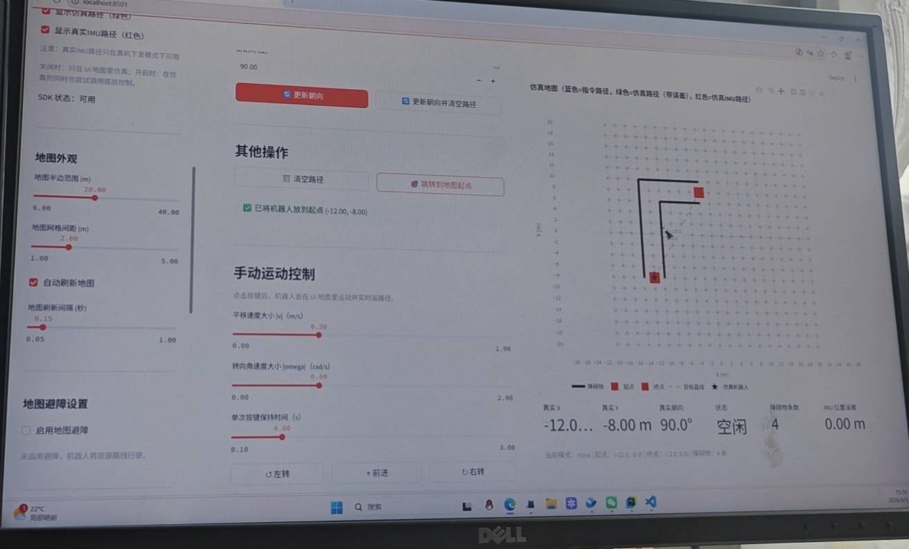

# 机器人项目 Demo 展示

> 本仓库用于集中展示机器人学习、避障控制、运动控制和可视化操作平台的项目成果。

## 视启未来

### 美甲效果展示1

https://github.com/user-attachments/assets/e80b7777-aa4c-4691-92ad-79b4f52a5b3b

### 美甲效果展示2

https://github.com/user-attachments/assets/28f269fe-4eb2-495a-8b41-2cd38da872b6

### RLT 操作网页

  

  

## 万仞

### G1避障展示

https://github.com/user-attachments/assets/608a68bb-6efd-4ee6-bc31-a46f73433c64

### G1 可视化操作网页

  

### 电机demo展示

https://github.com/user-attachments/assets/bd366b69-2143-4cc3-b854-71ae9414b283

### 机械臂demo展示

https://github.com/user-attachments/assets/1b91ce83-0de2-4ebd-960c-3d7f6ca8c7ac
